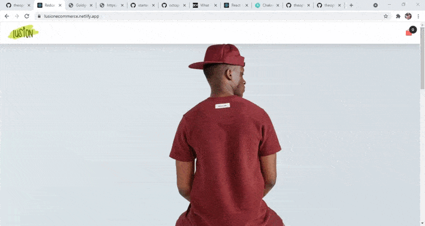

# Ecommerce React Redux

[Ecommerce React Redux](https://lusionecommerce.netlify.app/) An ecommerce website made with react and redux. Every implementation is currently done on the
frontend, Im working on a node express server for it.

## Table of Content

- [Demo](#demo)
- [Features](#features)
- [Built Using](#built-using)
- [Getting Started](#getting)
- [Deployment](#deployment)
- [Feedback](#feedback)
- [Author](#author)

## <a name="demo"></a> Demo



## <a name="features"></a> Features

- ### General Features
  - Cross-platform
  - Responsive
  - Accessible
  - cart

<br>

## <a name="built-using"></a> Built Using:

- React
- React Router dom
- Redux

## <a name="getting"></a> Getting Started:

1. Install dependencies

   ```bash
   npm i
   ```

2. Fire up the server and watch files

   ```bash
   npm start
   ```

## <a name="deployment"></a> Deployment:

1. Builds the app for production to the build folder.

   ```bash
   npm run build
   ```

## <a name="feedback"></a> Feedback

Any questions or suggestions? Notice any bugs or glitches? Feel free to send me an [email](mailto:theophilly20@gmail.com).

## <a name="author"></a> Author

Adeyemi Kolade (2021).
